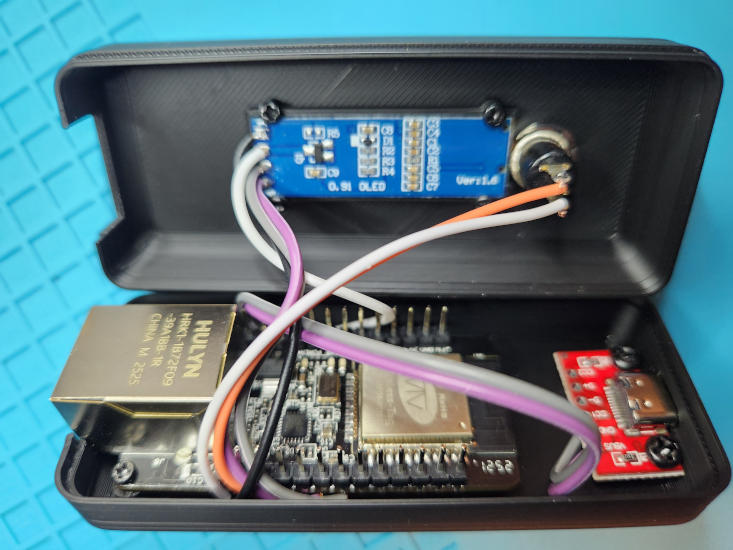
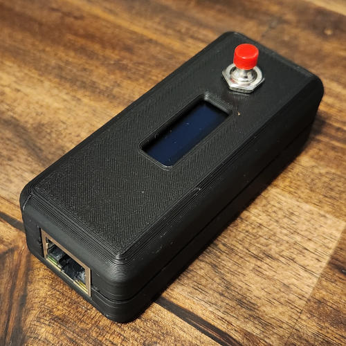
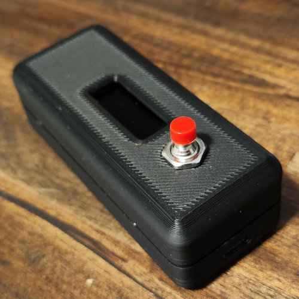

# Ethernet Checker Box

If you used the same parts as I did, this box should work pretty well for you.

You'll need:

- (6) M2x4 self-tapping screws
- (2) M3x4 self-tapping screws

Print the box with the large faces down. No supports are required.

- Use two of the M2x4 screws to mount the WT32-ETH01 to the standoffs near the end of the case bottom with the opening for the Ethernet jack.
- Use four of the M2x4 screws to mount the OLED display to the inside of the lid.
- Use the two M3x4 screws to mount the USB-C breakout board to the standoffs near the end of the case bottom with the opening for the USB-C port.

The box snaps together, but you may want a couple of dots of superglue to keep it in place. It's not that tight of a fit. Once you're done, it should look pretty decent.

